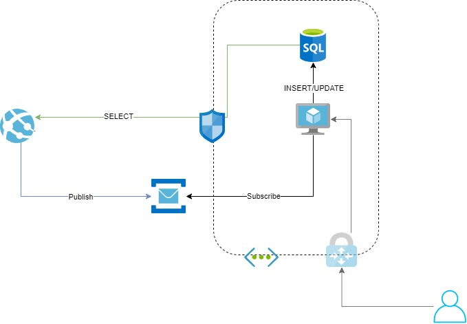

# Overview
This repository will provide a sample application that you can build and deploy to Azure.

# Architecture
This provided sample application is build with a CQRS (architecture) and presents a case where we have an API (Hosted in App Service) that consumes a SQL database to read data but uses a service bus to modify the data. 
We also have a worker (console application hosted in a VM) that represent the concept of a legacy application that we are migrating to the cloud without re-writing it to make it more cloud native.

CQRS gives us alot of advantages, to optimize our read data flow to be fast and our write data flow making it more robust. Read more [here](https://docs.microsoft.com/en-us/azure/architecture/patterns/cqrs) on CQRS.

We added a level of security by "hiding" our data stores behind a Virtual network, making our data flow private and hidden from public internet.



# Prerequisites 
To be able to run and deploy this sample application you need these tools:
- IDE: (Visual Studio, VS Code or Jetbrains Rider) to configure, build and publish the solution.
- [Azure CLI](https://docs.microsoft.com/en-us/cli/azure/get-started-with-azure-cli) 
- [Terraform for Azure](https://learn.hashicorp.com/collections/terraform/azure-get-started)

# Infrastructure (CLI & As-code)
0. Optional: If you do not have an Azure Subscriptions, follow this [guide](https://azure.microsoft.com/en-us/free/search/?&ef_id=EAIaIQobChMIv-mItvPy7AIVj6SyCh0E0Q8OEAAYASAAEgJDzfD_BwE:G:s&OCID=AID2100115_SEM_EAIaIQobChMIv-mItvPy7AIVj6SyCh0E0Q8OEAAYASAAEgJDzfD_BwE:G:s) and create one.
1. AZ cli: Start a terminal session (Powerhell, in the current folder) and run `az login` to login into your account.
2. AZ cli: Start with creating a Resource group "rg-workshop", `az group create --name rg-workshop --location westeurope`.
3. Azure Portal: Create a Virtual Network through the Azure Portal (with name "vnet"), with address space `10.0.0.0/16` and add a subnet "default" with CIDR address `10.0.0.0/24` OR run `az network vnet create -g rg-workshop  -n vnet  --address-prefixes 10.0.0.0/16  -l westeurope`. Read here for [More Info](https://docs.microsoft.com/en-us/azure/virtual-network/quick-create-portal)
4. AZ cli and ARM: Create a Virtual Machine by using Azure CLI
   1. Remember to add a password for your VM here './infrastructure/arm/parameters.json'
   2. Run `az deployment group create --resource-group rg-workshop --template-file ./infrastructure/ARM/template.json --parameters ./infrastructure/ARM/parameters.json`.
5. AZ cli: Create a Service Bus and a Queue
   1.  `az servicebus namespace create --resource-group rg-workshop --name sb-workshop-ci --location westeurope`
   2. `az servicebus queue create --resource-group rg-workshop --namespace-name sb-workshop-ci --name test`
   3. `az servicebus namespace authorization-rule keys list --resource-group rg-workshop --namespace-name sb-workshop-ci --name RootManageSharedAccessKey --query primaryConnectionString --output tsv`
6. AZ cli: Create a SQL Server and a SQL Database
   1. `az sql server create --name sql-workshop-ci --resource-group rg-workshop --location "westeurope" --admin-user sqladmin --admin-password <YOUR-PASSWORD>`
   2. `az sql server firewall-rule create -g rg-workshop -s sql-workshop-ci -n azureservices --start-ip-address 0.0.0.0 --end-ip-address 0.0.0.0`
   3. `az sql db create --resource-group rg-workshop  --server sql-workshop-ci --name workshop`
   4. `az network vnet subnet create  -g rg-workshop -n subnet-sql  --vnet-name vnet --address-prefix 10.0.9.0/24  --service-endpoints Microsoft.SQL`
   5. `az sql server vnet-rule create --server sql-workshop-ci --name vnet-rule -g rg-workshop --subnet subnet-sql --vnet-name vnet`
7. AZ cli: Create a Storage and Container
   1. `az storage account create --name stotfstatedev --resource-group rg-workshop --location westeurope --sku Standard_ZRS --encryption-services blob`
   2. `az storage container create --account-name stotfstatedev --name state --auth-mode login`
8. Terraform: Create an App Service with terraform and azurerm provider
   1. Open './infrastructure/terraform/' in VS code and add you subscription id and tennat id in './infrastructure/terraform/provider.tf'
   2. Navigate to './infrastructure/terraform/' in your terminal
   3.  In Terminal, run `terraform init` and then `terraform apply -auto-approve`

# API (back-end)

- [ASP.NET Core 3.1](https://dotnet.microsoft.com/learn/dotnet/hello-world-tutorial/intro)
- [MediatR](https://github.com/jbogard/MediatR) as [CQRS](https://docs.microsoft.com/en-us/azure/architecture/patterns/cqrs) implementation
- [AutoMapper](https://github.com/AutoMapper/AutoMapper) handling Entity-to-DTO mapping
- Unit and integration tests using [Moq](https://github.com/moq/moq4) and [MSTest](https://docs.microsoft.com/en-us/dotnet/core/testing/unit-testing-with-mstest)
- [Swagger UI](https://github.com/swagger-api/swagger-ui)

# Worker (back-end)

- [.NET Core 3.1](https://docs.microsoft.com/en-us/dotnet/core/tutorials/with-visual-studio)


# How to run locally

1. [Download and install the .NET Core SDK](https://dotnet.microsoft.com/download)
    * If you don't have `localdb` available on your system, [Download and install SQL Server Express](https://docs.microsoft.com/en-us/sql/database-engine/configure-windows/sql-server-express-localdb)
    * NOTE: We will remove the `localdb` requirement in a future PR
2. Open a terminal such as **PowerShell**, **Command Prompt**, or **bash** and navigate to the `service` folder
3. Run the following `dotnet` commands:
```sh
dotnet build
dotnet run --project Microsoft.DSX.ProjectTemplate.API
dotnet run --project Microsoft.DSX.ProjectTemplate.ConsoleApplication.API
```
3. Open your browser to: `https://localhost:44345/swagger`.

# Deployment
To use the previously created infrastructure, we can deploy our sample app './service/Microsoft.DSX.ProjectTemplate' to it. There is many ways to deploy an application to Azure but we choose the easiest one by using Visual Studio to publish.
1. Configure './service/Microsoft.DSX.ProjectTemplate.API/appsettings.json' to use our infra connection strings (values to replace are: Database, ServiceBus, Topic), to get connection strings from Azure please read more here:
   1. SQL Db: In Azure portal navigate to your sql database and under [Settings => Connection Strings] you will find your connection string
   2. Service Bus: In Azure portal navigate to your Service Bus and under [Shared access policies] click on the Policy and you will find your connection string
   3. Topic: In Azure portal navigate to your Service Bus and under [Queue] you will find your queue name
2. In Visual Studio: right click on `Microsoft.DSX.ProjectTemplate.API` project in the solution explorer window and click on publish, [read here for more info](https://docs.microsoft.com/en-us/visualstudio/deployment/quickstart-deploy-to-azure?view=vs-2019).
3. In Visual Studio: right click on `Microsoft.DSX.ProjectTemplate.ConsoleApplication` project in the solution explorer window and click on publish, [read here for more info](https://docs.microsoft.com/en-us/dotnet/core/tutorials/publishing-with-visual-studio).
4. In Azure Portal: Navigate to your VM and connect to it through a RDP session, [more info here](https://docs.microsoft.com/sv-se/azure/virtual-machines/windows/connect-logon).
   1. The login info for your VM can be found here `./infrastructure/ARM/parameters.json` at `adminUsername` and `adminPassword`.
5. Copy the previously published console application `./service/Microsoft.DSX.ProjectTemplate.ConsoleApplication/bin/Release/netcoreapp3.1/` to your VM through the RDP session.
6. Start the console application in your VM by running `./service/Microsoft.DSX.ProjectTemplate.ConsoleApplication/bin/Release/netcoreapp3.1/Microsoft.DSX.ProjectTemplate.ConsoleApplication.exe`
7. In a browser: Navigate to [Your API Swagger Page](https://api-workshop-ci.azurewebsites.net/swagger), use the Swagger UI to Get or Create Data. More info on how to use the Swagger UI, please read [Here](https://www.blazemeter.com/blog/getting-started-with-swagger-ui).

